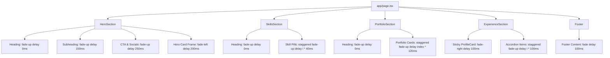

# Implementation Plan: Scroll Reveal Animation System

## 1. Executive Summary & Objective

Dokumen ini adalah rencana implementasi terperinci untuk menambahkan sistem animasi **Scroll Reveal (Fade & Slide-In Animation)** pada homepage website [aslammaulana.com](https://aslammaulana.com) berbasis [PRD (prd.md)](./prd.md).

* **Target Komponen:** Homepage (`app/page.tsx`) dan seluruh section turunannya.
* **Pendekatan Teknis:** Native Web API `IntersectionObserver` + CSS Transitions GPU-accelerated (`opacity`, `translate3d`).
* **Dependensi Eksternal:** 0 KB (Zero external libraries).
* **Target Performa:** 60 FPS stabil, CLS = 0, skor Lighthouse Performance >= 95.

---

## 2. Arsitektur & Spesifikasi Komponen

### 2.1 Komponen Reusable: `components/ui/ScrollReveal.tsx`
Komponen *Client Component Wrapper* (`'use client'`) yang membungkus elemen JSX atau komponen React.

#### Props Interface
```typescript
export type AnimationType = 'fade-up' | 'fade-down' | 'fade-left' | 'fade-right' | 'fade';

export interface ScrollRevealProps {
  children: React.ReactNode;
  animation?: AnimationType;
  duration?: number;    // default: 700 (ms)
  delay?: number;       // default: 0 (ms)
  distance?: string;    // default: '30px'
  threshold?: number;   // default: 0.15 (15% terlihat di layar)
  once?: boolean;       // default: true (unobserve setelah trigger)
  className?: string;   // default: ''
  as?: React.ElementType; // default: 'div'
}
```

#### Karakteristik Teknis
1. **GPU Acceleration:** Menggunakan kombinasi `opacity` dan `translate3d(x, y, z)` untuk memicu compositor layer GPU tanpa *repaint* atau *reflow*.
2. **A11y (Reduced Motion):** Memeriksa `window.matchMedia('(prefers-reduced-motion: reduce)')`. Jika aktif, elemen langsung ditampilkan tanpa transisi.
3. **Memory Safety:** Memanggil `observer.unobserve()` / `disconnect()` saat komponen unmount atau saat animasi sudah terpicu jika `once: true`.
4. **Transition Curve:** Menggunakan timing function smooth cubic bezier `cubic-bezier(0.16, 1, 0.3, 1)`.

---

## 3. Detail Rencana Integrasi Per Section



### 3.1 Step 1: Pembuatan Komponen Inti
* **File Baru:** `components/ui/ScrollReveal.tsx`
* **Tindakan:** Implementasikan komponen `<ScrollReveal>` lengkap dengan dukungan TypeScript, observer cleanup, dan dukungan A11y.

### 3.2 Step 2: Hero Section (`components/homepage/HeroSection.tsx`)
* **Target Elemen:**
  - **Main Heading (`h1`):** `animation="fade-up"` (duration: 700ms, delay: 0ms)
  - **Subheading & Description:** `animation="fade-up"` (duration: 700ms, delay: 150ms)
  - **CTA Resume Button & Social Icons:** `animation="fade-up"` (duration: 700ms, delay: 250ms)
  - **Kolom Kanan (Hero Image Card with Rim-Light):** `animation="fade-left"` (duration: 800ms, delay: 200ms)

### 3.3 Step 3: Skills Section (`components/homepage/SkillsSection.tsx`)
* **Target Elemen:**
  - **Section Title ("SKILLS"):** `animation="fade-up"` (delay: 0ms)
  - **Programming Skills Pills:** Staggered delay `delay={i * 40}` (animation: `fade-up`, duration: 500ms)
  - **Design Skills Pills:** Staggered delay `delay={(programmingSkills.length + i) * 40}` (animation: `fade-up`, duration: 500ms)

### 3.4 Step 4: Selected Portfolio Section (`components/homepage/portfolio/index.tsx`)
* **Target Elemen:**
  - **Section Title ("SELECTED PORTOFOLIO"):** `animation="fade-up"`
  - **Grid of Portfolio Cards:** Bungkus masing-masing `<PortfolioCard>` dengan `<ScrollReveal animation="fade-up" delay={index * 120} duration={600}>`.

### 3.5 Step 5: Experience & Profile Section (`components/homepage/experience/index.tsx`)
* **Target Elemen:**
  - **ProfileCard (Left Column):** `animation="fade-right"` (duration: 700ms)
  - **Experience Accordion Items:** Staggered `delay={i * 100}` (animation: `fade-up`)
  - **Training Accordion Items:** Staggered `delay={i * 100}` (animation: `fade-up`)
  - **Language Cards:** Staggered `delay={i * 80}` (animation: `fade-up`)

### 3.6 Step 6: Footer (`components/theme/Footer.tsx`)
* **Target Elemen:**
  - **Footer Container / Content:** `animation="fade"` (duration: 600ms, threshold: 0.1)

---

## 4. Testing & Verification Checklist

| Kategori | Item Pengujian | Metode Verifikasi | Target |
|:---|:---|:---|:---|
| **Visual / Motion** | Transisi halus saat scroll | Scrolling manual di Chrome & Safari | 60 FPS, tidak ada patah-patah |
| **Stagger Effect** | Kartu & pills muncul berurutan | Scroll ke section portfolio & skills | Delay bertingkat konsisten |
| **Responsive** | Mobile viewport (iPhone / Android) | Chrome Device Toolbar (375px - 768px) | Tidak ada layout shift/overflow horizontal |
| **A11y** | `prefers-reduced-motion` | Chrome DevTools > Rendering > Emulate CSS media feature `prefers-reduced-motion: reduce` | Animasi nonaktif, konten langsung terlihat |
| **Build & Typecheck** | Next.js Build | `npm run build` | Zero errors, zero warnings |
| **Core Web Vitals** | CLS & LCP | Lighthouse Audit | CLS = 0, Performance >= 95 |

---

## 5. Timeline & Langkah Eksekusi

1. ✅ **Observasi & Penyusunan Dokumen Rencana (Plan)**: Selesai.
2. ⏳ **Fase 1:** Pembuatan file `components/ui/ScrollReveal.tsx`.
3. ⏳ **Fase 2:** Integrasi ke `HeroSection.tsx` & `SkillsSection.tsx`.
4. ⏳ **Fase 3:** Integrasi ke `PortfolioSection` & `ExperienceSection`.
5. ⏳ **Fase 4:** Verifikasi build (`npm run build`) dan pengujian interaksi visual.
