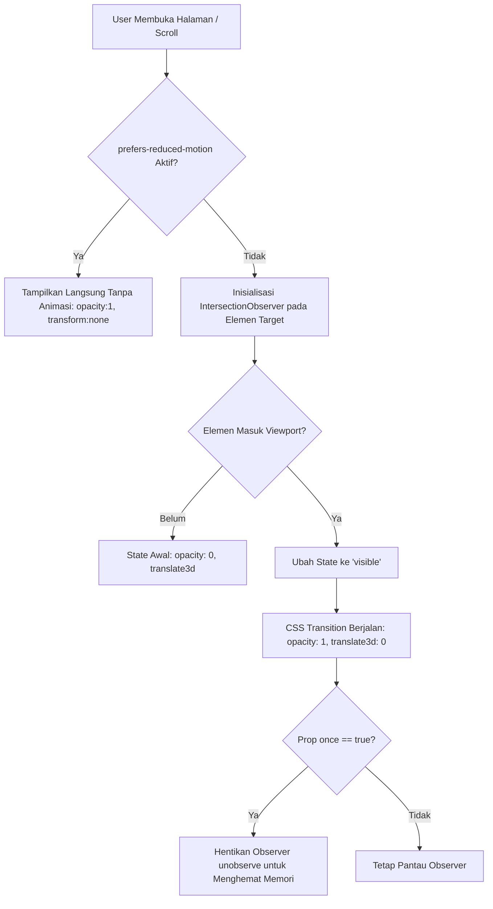

# Product Requirement Document (PRD)
# Lightweight Scroll Reveal Animation System untuk Next.js

---

## 1. Executive Summary & Objective

* **Judul Fitur:** Lightweight Scroll Reveal Animation System
* **Target Platform:** Next.js 13/14/15 (App Router & Pages Router, React 18/19)
* **Status:** Ready for Implementation
* **Prioritas:** High (UI/UX Enhancement)

### 1.1 Problem Statement
Homepage website memerlukan efek animasi *reveal* (fade-in & slide-up) saat pengguna menggulir (*scroll*) halaman agar tampilan terasa interaktif, dinamis, dan premium (seperti pada landing page `index.html`). Namun, penggunaan library animasi pihak ketiga yang berat (seperti full bundle library) dapat menambah ukuran bundle JavaScript (*bundle bloat*), memperlambat *First Input Delay* (FID) / *Interaction to Next Paint* (INP), dan menurunkan skor performa Core Web Vitals.

### 1.2 Tujuan & Target (OKRs)
1. **Zero External Dependency:** Menggunakan browser native Web API (`IntersectionObserver`) + CSS transitions (0 KB penambahan package eksternal).
2. **Performa 60 FPS:** Animasi sepenuhnya menggunakan *hardware acceleration* GPU (`opacity` dan `translate3d`), tanpa memicu *layout thrashing* atau *Cumulative Layout Shift* (CLS = 0).
3. **Kompatibilitas Next.js App Router:** Komponen dibuat sebagai *Client Component Wrapper* yang dapat membungkus *React Server Components* (RSC) tanpa merusak kapabilitas SEO dan SSR.
4. **Aksesibilitas (A11y):** Mendukung penuh standar aksesibilitas OS (`prefers-reduced-motion: reduce`).

---

## 2. User Stories & Use Cases

| ID | Persona | User Story & Ekspektasi |
|:---|:---|:---|
| **US-01** | Pengunjung Web | Saat saya men-scroll halaman, setiap section, judul, dan kartu informasi muncul perlahan dengan transisi halus (*fade & slide*), memberikan pengalaman visual yang menyenangkan. |
| **US-02** | Pengguna HP / Low-End Device | Halaman tetap dapat di-scroll dengan lancar tanpa *lag/stutter*, dan baterai/memori tidak terkuras. |
| **US-03** | Pengguna Kebutuhan Khusus (Reduced Motion) | Jika saya mengaktifkan mode "Reduce Motion" di sistem operasi, elemen langsung tampil tanpa animasi agar tidak menyebabkan pusing/disorientasi. |
| **US-04** | Web Developer | Saya dapat dengan mudah membungkus (*wrap*) elemen/komponen apapun dengan `<ScrollReveal>` dan mengatur arah animasi, durasi, delay *stagger* pada grid secara deklaratif. |

---

## 3. Architecture & Technical Flow

### 3.1 Diagram Alur Kerja (Workflow)



### 3.2 Key Technical Principles
1. **Compositor-Only Animations:** Hanya menggunakan properti CSS `opacity` dan `transform`. Tidak pernah menganimasikan `margin-top`, `top`, `height`, atau `padding`.
2. **Memory Safety:** Melakukan cleanup `observer.disconnect()` atau `observer.unobserve()` saat komponen *unmount*.
3. **Progressive Enhancement:** Jika JavaScript dimatikan, konten tetap bisa diakses dan terbaca oleh web crawler / search engine bot.

---

## 4. Functional Specification & Component API

Komponen utama: `<ScrollReveal />`

### 4.1 Props Interface (`ScrollRevealProps`)

| Prop | Tipe Data | Default | Keterangan |
|:---|:---|:---|:---|
| `children` | `React.ReactNode` | *(Wajib)* | Konten/elemen JSX yang akan dianimasikan. |
| `animation` | `'fade-up' \| 'fade-down' \| 'fade-left' \| 'fade-right' \| 'fade'` | `'fade-up'` | Arah pergerakan animasi saat elemen muncul. |
| `duration` | `number` (ms) | `700` | Durasi waktu transisi dalam satuan milidetik. |
| `delay` | `number` (ms) | `0` | Delay waktu sebelum transisi dimulai (berguna untuk *stagger effect*). |
| `distance` | `string` / `number` | `'35px'` | Jarak pergeseran elemen sebelum masuk viewport. |
| `threshold` | `number` (0.0 - 1.0) | `0.15` | Berapa persen elemen harus terlihat di layar sebelum animasi aktif. |
| `once` | `boolean` | `true` | Jika `true`, animasi hanya terpicu 1x saat pertama kali terlihat. |
| `className` | `string` | `''` | Class tambahan untuk styling/layout (misal class Tailwind CSS). |
| `as` | `React.ElementType` | `'div'` | Tag HTML pembungkus (misal `'div'`, `'section'`, `'article'`). |

---

## 5. Source Code Implementasi (Ready-to-Use)

### 5.1 Komponen Reusable: `components/ui/ScrollReveal.tsx`

```tsx
'use client';

import React, { useEffect, useRef, useState } from 'react';

export type AnimationType = 'fade-up' | 'fade-down' | 'fade-left' | 'fade-right' | 'fade';

export interface ScrollRevealProps {
  children: React.ReactNode;
  animation?: AnimationType;
  duration?: number;   // dalam ms
  delay?: number;      // dalam ms
  distance?: string;   // misal: '35px'
  threshold?: number;  // 0.0 - 1.0
  once?: boolean;
  className?: string;
  as?: React.ElementType;
}

export default function ScrollReveal({
  children,
  animation = 'fade-up',
  duration = 700,
  delay = 0,
  distance = '35px',
  threshold = 0.15,
  once = true,
  className = '',
  as: Component = 'div',
}: ScrollRevealProps) {
  const [isVisible, setIsVisible] = useState(false);
  const domRef = useRef<HTMLElement>(null);

  useEffect(() => {
    // 1. Dukungan Aksesibilitas (Reduced Motion)
    const prefersReducedMotion = window.matchMedia('(prefers-reduced-motion: reduce)').matches;
    if (prefersReducedMotion) {
      setIsVisible(true);
      return;
    }

    // 2. Setup IntersectionObserver
    const observer = new IntersectionObserver(
      ([entry]) => {
        if (entry.isIntersecting) {
          setIsVisible(true);
          if (once && domRef.current) {
            observer.unobserve(domRef.current);
          }
        } else if (!once) {
          setIsVisible(false);
        }
      },
      { threshold }
    );

    const currentElement = domRef.current;
    if (currentElement) {
      observer.observe(currentElement);
    }

    return () => {
      if (currentElement) observer.unobserve(currentElement);
    };
  }, [threshold, once]);

  // 3. Mapping kalkulasi transform awal
  const getInitialTransform = () => {
    switch (animation) {
      case 'fade-up':    return `translate3d(0, ${distance}, 0)`;
      case 'fade-down':  return `translate3d(0, -${distance}, 0)`;
      case 'fade-left':  return `translate3d(${distance}, 0, 0)`;
      case 'fade-right': return `translate3d(-${distance}, 0, 0)`;
      case 'fade':       return 'translate3d(0, 0, 0)';
      default:           return `translate3d(0, ${distance}, 0)`;
    }
  };

  const animationStyle: React.CSSProperties = {
    opacity: isVisible ? 1 : 0,
    transform: isVisible ? 'translate3d(0, 0, 0)' : getInitialTransform(),
    transitionProperty: 'opacity, transform',
    transitionDuration: `${duration}ms`,
    transitionTimingFunction: 'cubic-bezier(0.16, 1, 0.3, 1)', // Smooth ease-out
    transitionDelay: `${delay}ms`,
    willChange: isVisible ? 'auto' : 'opacity, transform',
  };

  return (
    <Component
      ref={domRef as any}
      style={animationStyle}
      className={className}
    >
      {children}
    </Component>
  );
}
```

---

### 5.2 Contoh Penggunaan di Homepage: `app/page.tsx`

```tsx
import ScrollReveal from '@/components/ui/ScrollReveal';

export default function HomePage() {
  const features = [
    { id: '01', title: 'Bawa Tas Sendiri', desc: 'Tolak kantong plastik sekali pakai.' },
    { id: '02', title: 'Tumbler & Sedotan', desc: 'Gunakan botol minum ramah lingkungan.' },
    { id: '03', title: 'Kompos Sampah', desc: 'Ubah sisa makanan organik jadi pupuk gratis.' },
  ];

  return (
    <main className="min-h-screen bg-[#0d1f17] text-white px-6 py-20 space-y-32">
      
      {/* 1. Hero Section */}
      <section className="text-center max-w-3xl mx-auto space-y-6">
        <ScrollReveal animation="fade-down" duration={600}>
          <span className="text-xs uppercase tracking-wider text-emerald-400 bg-emerald-950/60 px-4 py-1.5 rounded-full border border-emerald-500/20">
            Gerakan Zero Waste Indonesia
          </span>
        </ScrollReveal>

        <ScrollReveal animation="fade-up" delay={150} duration={800}>
          <h1 className="text-5xl md:text-6xl font-bold tracking-tight">
            Hidup <span className="text-emerald-400">Bersih</span>, Bumi <span className="text-emerald-400">Sehat</span>
          </h1>
        </ScrollReveal>

        <ScrollReveal animation="fade-up" delay={300} duration={800}>
          <p className="text-gray-300 text-lg leading-relaxed">
            Bergabunglah dalam gerakan hidup minim sampah bersama Hijau Nusantara. Mulai dari langkah kecil hari ini.
          </p>
        </ScrollReveal>
      </section>

      {/* 2. Grid Section dengan Efek Stagger (Beruntun) */}
      <section className="max-w-5xl mx-auto">
        <ScrollReveal animation="fade-up" className="text-center mb-12">
          <h2 className="text-3xl font-bold">Tips Hidup Ramah Lingkungan</h2>
          <p className="text-gray-400 mt-2">Langkah sederhana yang bisa kamu terapkan setiap hari.</p>
        </ScrollReveal>

        <div className="grid grid-cols-1 md:grid-cols-3 gap-6">
          {features.map((item, index) => (
            <ScrollReveal
              key={item.id}
              animation="fade-up"
              delay={index * 150} // Delay berjenjang: 0ms, 150ms, 300ms
              duration={600}
            >
              <div className="p-6 rounded-2xl bg-white/5 border border-white/10 hover:border-emerald-400/40 transition">
                <span className="text-2xl font-bold text-emerald-400">{item.id}</span>
                <h3 className="text-xl font-semibold mt-3">{item.title}</h3>
                <p className="text-gray-400 mt-2 text-sm leading-relaxed">{item.desc}</p>
              </div>
            </ScrollReveal>
          ))}
        </div>
      </section>

    </main>
  );
}
```

---

## 6. Testing & Acceptance Criteria (KPI)

| Parameter | Target Pengujian | Cara Verifikasi |
|:---|:---|:---|
| **Bundle Size Overhead** | **0 KB** library JS tambahan. | Cek `package.json` dan hasil `npm run build`. |
| **Lighthouse Performance** | Skor Performance **>= 95** | Jalankan Chrome DevTools Lighthouse Audit (Mobile & Desktop). |
| **Cumulative Layout Shift** | **CLS = 0** (tidak ada pergeseran tata letak saat elemen muncul). | Lighthouse / Performance Profiler. |
| **Frame Rate** | Stabil **60 FPS** saat scrolling cepat. | Buka tab *Rendering > Frame Rendering Stats* di DevTools. |
| **A11y (Reduced Motion)** | Animasi dinonaktifkan jika OS menyalakan Reduce Motion. | Emulasikan `prefers-reduced-motion` di Chrome Rendering DevTools. |
| **SSR / Crawler Safety** | Seluruh konten teks tetap ter-render di dalam HTML mentah. | Lakukan *View Page Source* (Ctrl+U). |

---

## 7. Panduan Penerapan Bertahap (Rollout Plan)

1. **Tahap 1 - Setup:** Salin file `ScrollReveal.tsx` ke dalam folder `components/ui/` di project Next.js Anda.
2. **Tahap 2 - Pasang pada Section Kunci:** Mulai terapkan pada elemen Hero (Title, Subtitle, CTA Button).
3. **Tahap 3 - Pasang pada Grid / Card:** Terapkan pada Card Grid (produk, testimoni, tips) dengan menggunakan kalkulasi `delay={index * 120}` untuk efek muncul beruntun.
4. **Tahap 4 - Quality Assurance:** Jalankan audit Lighthouse dan pengujian tampilan di mobile browser.
